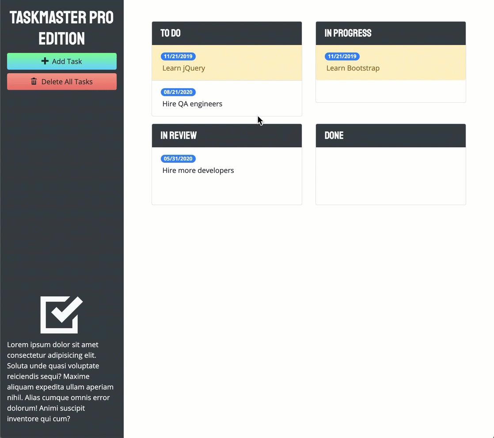

# taskmaster-pro


Please visit our completed webpage at:  https://raedaltaki.github.io/taskmaster-pro/



## Table of Contents 

- [Description](#description)
- [Installation](#installation)
- [Usage](#usage)
- [Languages and Technology](#languages-and-technology)
- [Screenshots](#screenshots)
- [Contributing](#contributing)
- [Questions](#Questions)
- [License](#license)

## Description

taskmaster-pro is a task managment Application that helps you organize your tasks based on their status and time


## Installation

There is no installation required. This application can be run on any web browser. 

If you want to use it to make your own project:

```
// Clone the repository to your local machine using:

git clone git@github.com:raedaltaki/taskmaster-pro.git
```

## Usage

  Deployed Application: https://raedaltaki.github.io/taskmaster-pro/

  Github Reprository: https://github.com/raedaltaki/taskmaster-pro


## Languages and Technology


- [JQuery](https://jquery.com/ "JQuery")<br />
- [JQuery-ui](https://jqueryui.com/ "JQuery-ui")<br />
- [Bootstrap](https://getbootstrap.com/ "Bootstrap")<br />
- [Google-fonts](https://fonts.google.com/ "Google-fonts")<br />
- [moment](https://momentjs.com/ "moment")<br />


## Screenshots


 <br /><br />


## Contributing

https://courses.bootcampspot.com/

If you would like to contribute, please reach out to us. You can find us at https://github.com/raedaltaki/

## Questions

For addition questions, Please reach me at:

GITHUB: https://github.com/raedaltaki
  
Email: raed.simon@gmail.com

## License

This project is licensed under the MIT license.

Copyright (c) 2021 

Permission is hereby granted, free of charge, to any person obtaining a copy of this software and associated documentation files (the "Software"), to deal in the Software without restriction, including without limitation the rights to use, copy, modify, merge, publish, distribute, sublicense, and/or sell copies of the Software, and to permit persons to whom the Software is furnished to do so, subject to the following conditions:

The above copyright notice and this permission notice shall be included in all copies or substantial portions of the Software.

THE SOFTWARE IS PROVIDED "AS IS", WITHOUT WARRANTY OF ANY KIND, EXPRESS OR IMPLIED, INCLUDING BUT NOT LIMITED TO THE WARRANTIES OF MERCHANTABILITY, FITNESS FOR A PARTICULAR PURPOSE AND NONINFRINGEMENT. IN NO EVENT SHALL THE AUTHORS OR COPYRIGHT HOLDERS BE LIABLE FOR ANY CLAIM, DAMAGES OR OTHER LIABILITY, WHETHER IN AN ACTION OF CONTRACT, TORT OR OTHERWISE, ARISING FROM, OUT OF OR IN CONNECTION WITH THE SOFTWARE OR THE USE OR OTHER DEALINGS IN THE SOFTWARE.


